# 🏨 Hotel Simulation Core

**Hotel Simulation Core** is a simulated environment for hotel operations, focused on the **Housekeeping** area.  
It serves as a foundation for experimenting, developing, and integrating planning and task allocation systems within a living virtual hotel.

The system dynamically generates data: rooms, staff, reservations, and simulated check-in/check-out events — all configurable through a YAML file.

---

## 🚀 Key Features

- Flexible configuration for hotel size, buildings, room types, and staff.  
- Automatic generation of rooms, staff, and reservations.  
- Continuous simulation of new bookings with random durations.  
- Open REST API to query current hotel state.  
- Modular architecture ready for extensions (housekeeping, analytics, maintenance, etc.).  
- Built with **FastAPI**, ideal for open source projects and integrations.

---

## 🧩 Project Structure

```
hotel-sim-core/
│
├── main.py                 # Entry point
├── api.py                  # REST endpoints
├── simulation.py           # Simulation engine
├── models.py               # Data models (rooms, staff, reservations)
├── config.yaml             # Hotel configuration file
├── data/
│   └── seeds.py            # Data generators
├── requirements.txt        # Python dependencies
└── README.md
```

---

## 🧠 Simulation Flow

This diagram represents the main lifecycle of the simulation: how reservations and events affect the housekeeping workflow.

```mermaid
flowchart TD
    A[Simulation Start] --> B[Load Configuration → config.yaml]
    B --> C[Generate Rooms & Staff]
    C --> D[Start Reservation Simulation]
    D -->|Every X seconds| E[New Reservation Event]
    E --> F[Room Marked as Occupied]
    F --> G[Wait for Checkout]
    G -->|Checkout Event| H[Create Cleaning Task]
    H --> I[Assign Available Housekeeper]
    I --> J[Update Productivity Metrics]
    J --> D
```



💡 Future phases will include:
- Maintenance and repair events.
- Supervisor reports.
- Integration with external booking or IoT systems.

---

## ⚙️ Requirements

- Python **3.9+**
- pip
- Git (optional, for cloning)

---

## 🧰 Installation

### 1. Clone the repository
```bash
git clone https://github.com/youruser/hotel-sim-core.git
cd hotel-sim-core
```

### 2. Create a virtual environment
```bash
python3 -m venv venv
```

### 3. Activate the environment

#### macOS / Linux:
```bash
source venv/bin/activate
```

#### Windows:
```bash
venv\Scripts\Activate.ps1
```

### 4. Install dependencies
```bash
pip install -r requirements.txt
```

---

## ⚙️ Configuration

Edit the `config.yaml` file to customize your simulation.

Example:

```yaml
hotel:
  name: "Hotel Simulado Riviera"
  num_buildings: 3
  rooms_per_building: 40

room_types:
  - type: "standard"
    ratio: 0.6
    clean_time: 30
  - type: "premium"
    ratio: 0.3
    clean_time: 45
  - type: "suite"
    ratio: 0.1
    clean_time: 60

staff:
  supervisors: 2
  housekeepers: 8
  max_tasks_per_shift: 10

simulation:
  reservation_interval_seconds: 15
  avg_stay_days: 3
  seed: 42
```

---

## ▶️ Run the Simulation

Start the local server with:

```bash
python main.py
```

The API will be available at:  
👉 **http://localhost:8000**

Interactive docs:  
👉 **http://localhost:8000/docs**

Endpoints:
- `/api/rooms` → list of rooms
- `/api/staff` → list of staff
- `/api/reservations` → active reservations

---

## 🔄 Example Event

```json
{
  "event": "guest_checkout",
  "timestamp": "2025-11-06T10:00:00Z",
  "room_id": 312,
  "building_id": 3,
  "reservation_id": 5521,
  "trigger": "system",
  "actions": ["create_cleaning_task"]
}
```

---

## 🧮 Future Roadmap

| Phase | Goal |
|-------|------|
| 2️⃣ | Housekeeping engine (cleaning durations, automatic assignments). |
| 3️⃣ | Efficiency metrics and workload analysis. |
| 4️⃣ | Visual dashboard for live monitoring. |
| 5️⃣ | External integrations (real booking data, maintenance, sensors). |

---

## 🤝 Contributing

Open to contributions!

1. Fork the repo  
2. Create a feature branch (`git checkout -b feature/new-functionality`)  
3. Commit your changes and open a Pull Request

---

## 📄 License

Licensed under the **MIT License**.

---

## 💡 Author

Developed by **Xavier Alfeirán**  
Mindware / WebRoster Labs – 2025  
Cancún, México 🌴

> “Simulate to understand, model to optimize.”
